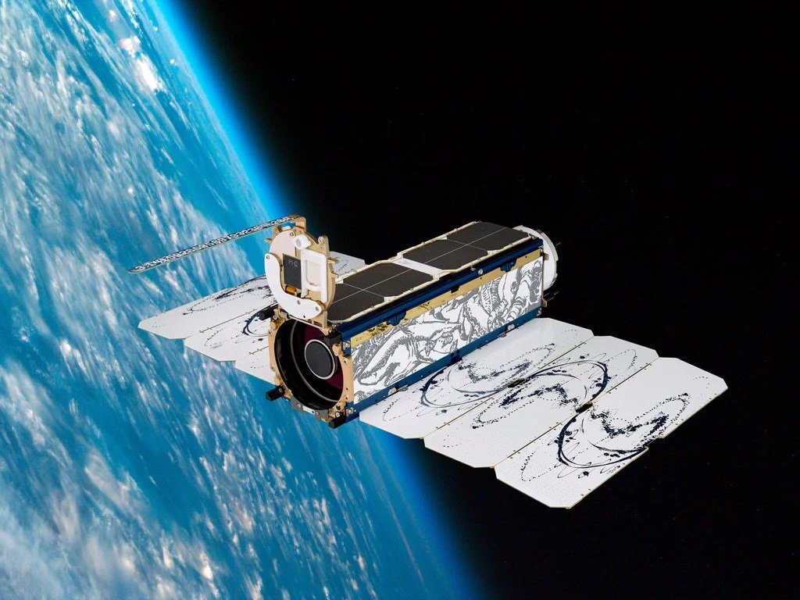

## [Planet Scope](https://www.planet.com/?gclid=EAIaIQobChMIqrmrgL6b_QIVIoJaBR0bDATNEAAYASAAEgLKqfD_BwE) Is a private company that provides daily satellites data at high resolutions >3m

"Remote sensing is the process of detecting and monitoring the physical characteristics of an area without being present" - USGS. Is being highly used by scientist for studying large amount of areas, using instruments like satellite, airplane and drones. To study the ocean primary production, scientist have created different algorithms depending on the sensor used. The most common used is OCX (Ocean color #). The Ocean Color algorithm had been developed for old satellites with low spatial resolutions (**CZCS 825m**) as to new satellites with high spatial resolution (**Sentinel 2 (10M), Landsat 8 (30m)**).

To study the open ocean is not necessary to have high resolutions, the problems comes when studying coastal ocean color. As a scientist, you need high spatial resolution in order (**less squared meter per pixel**) (less than 30m resolution) to answer questions of process near the coast. The most used satellites for coastal studies had been Landsat 8 (30m), and sentinel 2 (10m). 

In the year 2021, the company Planet Scope announced that their satellites SuperDove were available for use. This satellite has a resolution of 3m with 8 bands. That makes this satellites perfect for the study of coastal zones and ocean color. Nevertheless, none algorithms had been tested for ocean color or coastal ocean color. 

In [Bio-optical Laboratory](http://bio-optics.uprm.edu/) we are testing different OCx algorithms used in different satellites and try to search the best one for SuperDove, as to develope alphas values specially for this new satellite. 

---

